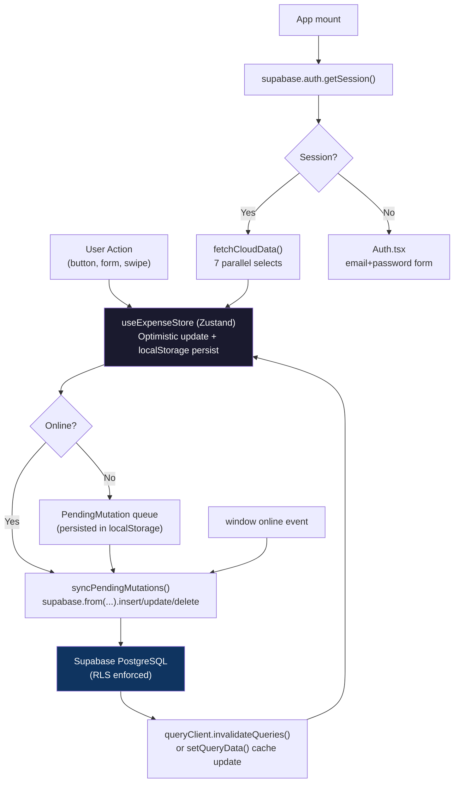
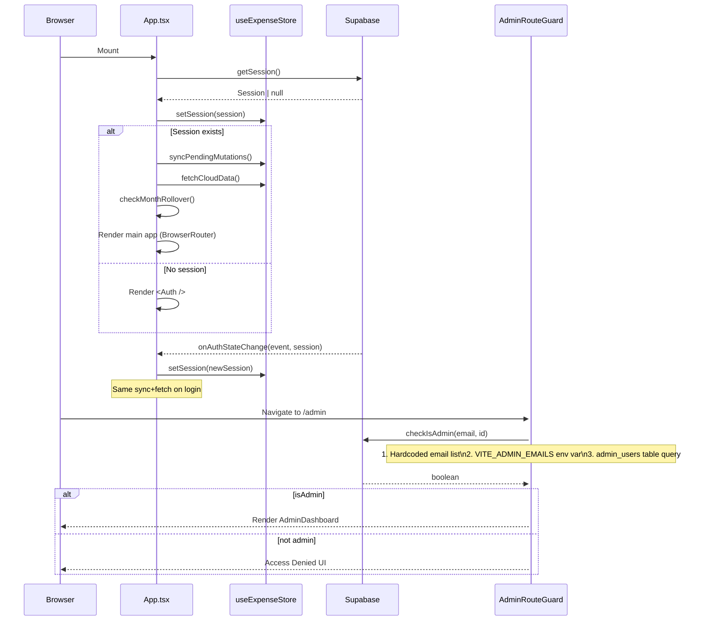

# Architecture Audit — Expense Tracker PWA
> **Audit Date:** 2026-09-21 | **Auditor:** Read-only automated review | **Repo:** `dev4nithinkumarreddy/expense-tracker`

---

## 1. PROJECT OVERVIEW

### Purpose & Target Users
A **personal-finance Progressive Web App (PWA)** aimed at individual users who want to track daily spending, manage recurring bills, view analytics, and build good financial habits via gamification. A built-in admin portal (hidden from regular users) lets the app owner broadcast push notifications and inspect platform-wide activity.

### What the App Does
- Records expenses with category, date, notes, and optional receipt photos
- Tracks monthly income vs. spending, showing a live "remaining balance"
- Manages recurring bills, subscriptions, IOUs (debts), and wishlist / savings goals
- Generates analytics charts (category breakdown, multi-month trends, daily spend)
- Sends Web Push Notifications triggered by Supabase Edge Functions
- Works offline: mutations are queued locally and synced when back online
- Supports OCR receipt scanning via Tesseract.js (fully client-side)
- Admin-only portal for push-campaign management and platform telemetry

### Full Tech Stack

| Library | Version | Role |
|---|---|---|
| React | ^19.2.7 | UI framework |
| TypeScript | ~6.0.2 | Type safety |
| Vite | ^8.1.1 | Build tool, dev server |
| vite-plugin-pwa | ^1.3.0 | PWA manifest + service worker |
| react-router-dom | ^7.18.1 | Client-side routing |
| Zustand | ^5.0.14 | Global state + local persistence |
| @tanstack/react-query | ^5.101.4 | Server-state caching (partially used) |
| @supabase/supabase-js | ^2.110.7 | BaaS: auth, database, storage, Edge Functions |
| Tailwind CSS | ^3.4.19 | Utility-first styling |
| framer-motion | ^13.1.1 | Page transitions, drag-to-reorder, animations |
| recharts | ^3.9.2 | Bar/Line/Pie charts in Analytics page |
| sonner | ^2.0.8 | Toast notifications |
| lucide-react | ^1.24.0 | Icon set |
| date-fns | ^4.4.0 | Date arithmetic |
| tesseract.js | ^7.0.0 | Client-side OCR for receipts |
| react-swipeable | ^7.0.2 | Swipe-to-delete on expense rows |
| clsx + tailwind-merge | ^2.1.1 / ^3.6.0 | Conditional class names |
| @vercel/analytics | ^2.0.1 | Page-view tracking |
| oxlint | ^1.71.0 | Linting (dev) |
| vitest | ^4.1.10 | Unit testing |
| @testing-library/react | ^16.3.2 | Component testing helpers |

> **Note:** `vitest`, `jsdom`, `@testing-library/*` are listed as **`dependencies`** (not `devDependencies`), which inflates the production bundle unnecessarily.

### Build, Lint & Dev Scripts (`package.json`)

| Script | Command | Notes |
|---|---|---|
| `dev` | `vite` | Dev server with HMR |
| `build` | `tsc -b && vite build` | Type-checks then bundles |
| `lint` | `oxlint` | Minimal rules (hooks + export conventions only) |
| `preview` | `vite preview` | Serve built dist locally |

No `test` script is defined in `package.json`; tests must be run via `npx vitest` directly. There is no CI configuration (no `.github/workflows/` found).

---

## 2. FEATURE INVENTORY

### Auth
| Feature | What it does | Components / Files | Status |
|---|---|---|---|
| Sign In | Email + password login | `Auth.tsx` → `supabase.auth.signInWithPassword` | ✅ Complete |
| Sign Up | Email + password registration | `Auth.tsx` → `supabase.auth.signUp` | ✅ Complete |
| Password Reset | Email reset link | `Auth.tsx` → `supabase.auth.resetPasswordForEmail` | ✅ Complete |
| Session persistence | `getSession()` on mount, `onAuthStateChange` listener | `App.tsx` L24-44 | ✅ Complete |
| Sign Out | Button in Settings page | `Settings.tsx` → `supabase.auth.signOut()` | ✅ Complete |

No OAuth / social login. No email-verification enforcement in the UI — Supabase handles it at the DB level but the UI shows the dashboard immediately after `signUp`.

---

### Expenses (`/expenses` — `Expenses.tsx`, 357 lines)
| Feature | What it does | Store / API | Status |
|---|---|---|---|
| Log expense | Modal form: amount, description, category, date, notes, receipt photo, recurrence | `addExpense` → `INSERT_EXPENSE` mutation | ✅ Complete |
| Edit expense | Re-opens modal pre-filled; swipe left on row reveals edit | `updateExpense` → `UPDATE_EXPENSE` | ✅ Complete |
| Delete expense | Swipe right or trash icon; keeps in `recentlyDeleted` for 50 items | `deleteExpense` + toast undo | ✅ Complete |
| Undo delete | Toast "Undo" button calls `restoreExpense` | `restoreExpense` → `INSERT_EXPENSE` | ✅ Complete |
| Recently Deleted / Trash | Modal listing soft-deleted expenses, permanent delete or restore | `RecentlyDeletedModal.tsx` | ✅ Complete |
| Search | Real-time debounced 300 ms search by description/category | local filter in `Expenses.tsx` | ✅ Complete |
| Category filter | Dropdown over category list | local filter | ✅ Complete |
| Date filter | This month / Last month / Last 7 days | local filter | ✅ Complete |
| Amount range filter | Min/max amount inputs | local filter | ✅ Complete |
| Quick filters | Receipt-only / High spend (≥1000) / Recurring (heuristic) | local filter | ⚠️ Partial — "recurring" uses `(e as any).is_recurring` cast + heuristic; no DB field |
| Receipt lightbox | Full-screen image viewer for receipt photos | `ReceiptLightbox.tsx` | ✅ Complete |
| CSV export | Button downloads all filtered expenses as CSV | inline in `Expenses.tsx` | ✅ Complete |
| Receipt OCR scan | Tesseract.js scans photo → fills amount & description | `AddExpenseModal.tsx` | ✅ Complete |
| Recurring expenses | `recurrence` field (daily/weekly/monthly); `checkMonthRollover` generates clones on next visit | `useExpenseStore.ts` L1010-1078 | ⚠️ Partial — generated clones are **not** synced via the pending-mutation queue; they are bulk-inserted directly in `checkMonthRollover` without error handling or dedup protection |

---

### Dashboard (`/` — `Dashboard.tsx`, 745 lines)
| Feature | What it does | Status |
|---|---|---|
| Remaining balance | `monthlyIncome + extraIncome - expenses - dueBills - dueSubs` | ✅ Complete |
| Budget ring | SVG ring showing % of budget consumed | ✅ Complete |
| Today / This Week cards | Spend totals with daily allowance progress bar and 7-day sparkline | ✅ Complete |
| Category budget bars | Progress bars per category for the current month | ✅ Complete |
| Quick Add shortcuts | Configurable one-tap expense buttons | ✅ Complete |
| Log Again | Re-logs a recent expense for today | ✅ Complete |
| Upcoming Bills scroll | Horizontal card row showing all bills | ✅ Complete |
| Subscription due alert | Pill alert when a subscription is due within 48 hours | ✅ Complete |
| Privacy mode | Blurs all amounts with `₹****` | ✅ Complete |
| Streak badge | Shows 🔥 N Day Streak in header | ✅ Complete |
| Admin portal link | ShieldCheck icon in header, visible only to admins | ✅ Complete |
| Pull to refresh | Triggers `fetchCloudData` | ✅ Complete |
| Add extra income | Inline form logged as `category: 'Income'` expense | ✅ Complete |

---

### Planned (`/planned` — `Planned.tsx`, 772 lines)
Segmented tabs: **Bills | Subs | Wishlist | IOUs**

| Tab | Features | Status |
|---|---|---|
| Bills | List, add, edit, delete recurring bills; per-bill due-day status badge; "Pay Now" one-click expense | ✅ Complete |
| Subs (Subscriptions) | Monthly/yearly subscriptions with next billing date, pay/log button, cycle auto-advance | ✅ Complete |
| Wishlist | Add items with estimated cost; mark purchased (which also logs an expense); savings goal progress | ✅ Complete |
| IOUs (Debts) | Track "To Collect" / "To Pay"; settle debt with one click (logs expense + marks settled) | ✅ Complete |

---

### Analytics (`/analytics` — `Analytics.tsx`, ~1040 lines)
| Feature | What it does | Files | Status |
|---|---|---|---|
| Month KPIs | Total spent, income, savings rate, daily avg, projected month-end, % change vs. last month, peak day, largest expense | `lib/analytics.ts` `calculateMonthKPIs` | ✅ Complete |
| Category breakdown pie/bar | `calculateCategoryBreakdown`; budget overlays | `Analytics.tsx` + Recharts | ✅ Complete |
| Multi-month trend bar chart | 6-month expenses/income/savings | `calculateMultiMonthTrends` | ✅ Complete |
| Daily spend bar chart | Per-day spend for selected month | `calculateDailySpend` | ✅ Complete |
| Smart Insights | Auto-generated text cards (savings rate, budget violations, MoM shift, etc.) | `generateSmartInsights` | ✅ Complete |
| Month calendar grid | Heatmap-style calendar with daily totals; tap a day to inspect transactions | `MonthCalendarGrid.tsx`, `DateTransactionsInspector.tsx` | ✅ Complete |
| Category detail modal | Drill-down into a category for the month | `CategoryDetailModal.tsx` | ✅ Complete |
| Month selector | Swipe left/right to navigate months | `Analytics.tsx` + `react-swipeable` | ✅ Complete |

All calculations are **local/in-memory** (no Supabase query for analytics); they run directly on the Zustand `expenses` array.

---

### Settings (`/settings` — `Settings.tsx`, 582 lines)
| Feature | Status |
|---|---|
| Monthly income | ✅ |
| Currency symbol (free text) | ✅ |
| Dark / Light mode | ✅ |
| Color theme (multiple themes via CSS classes) | ✅ |
| Categories CRUD + drag-to-reorder | ✅ |
| Per-category emoji assignment | ✅ |
| Per-category monthly budget limit | ✅ (saved via `updateBudget`) |
| Quick Add presets management | ✅ |
| Push notifications toggle | ✅ |
| Carry-forward balance toggle | ✅ |
| Sound effects toggle | ✅ |
| Privacy mode toggle | ✅ |
| Username (display name) | ✅ |
| Export data (CSV) | ✅ |
| Erase all data | ✅ — deletes from all Supabase tables + resets local state |
| Sign Out | ✅ |
| Recently Deleted shortcut | ✅ |
| Admin Portal link (conditional) | ✅ |

Settings are saved immediately to `user_settings` via `supabase.from('user_settings').upsert(...)` on every change — no debounce, no error-recovery toast.

---

### Admin Portal (`/admin` — `AdminDashboard.tsx`, 1304 lines)
Visible only to users whose email matches a hardcoded list OR the `admin_users` table.

| Feature | What it does | Status |
|---|---|---|
| Platform analytics | Total users, active today/week, push subscribers, device breakdown; via Edge Function or direct query fallback | ✅ Complete |
| User inspector | Click a user row → slide-out sheet with spend totals, top categories, recent expenses | ✅ (via Edge Function `get_user_details`) |
| Immediate push broadcast | Send push to all / inactive-today / active-streaks audiences | ✅ Complete |
| Direct nudge | Send a 1-on-1 push to a specific user | ✅ Complete |
| Scheduled notifications | Create, list, cancel scheduled campaigns with countdown timer | ✅ Complete |
| Notification log history | View delivery history with success/fail/CTR counts | ✅ Complete |
| Automated smart rules | Toggle on/off daily inactivity / streak-saver / Sunday wrap-up cron rules | ✅ Complete |
| Admin team management | Add/remove emails from `admin_users` whitelist | ✅ Complete |
| Phone mockup preview | Live preview of push notification on a phone outline | ✅ Complete |
| Macro charts | Bar charts of platform-wide category spend and hourly distribution | ✅ Complete |
| System health ping | Latency test to Edge Function | ✅ Complete |

### Admin vs. Regular User Differences
| Aspect | Regular User | Admin |
|---|---|---|
| Route `/admin` | Blocked by `AdminRouteGuard` (redirects with access-denied UI) | Full access |
| Dashboard header | Settings icon only | Settings icon + ShieldCheck icon |
| Settings page | No admin link | Admin portal link appears |
| Data scope | Own data only (RLS enforced) | Platform-wide data via Edge Function with service role |
| Push broadcasts | Cannot send | Can broadcast to all users |

---

## 3. ARCHITECTURE

### High-Level Data Flow



### Routing Map

| Path | Component | Guard |
|---|---|---|
| `/` | `Dashboard` (eagerly loaded) | Session check in `App.tsx` |
| `/expenses` | `Expenses` (lazy) | Session check in `App.tsx` |
| `/planned` | `Planned` (lazy) | Session check in `App.tsx` |
| `/analytics` | `Analytics` (lazy) | Session check in `App.tsx` |
| `/settings` | `Settings` (lazy) | Session check in `App.tsx` |
| `/admin` | `AdminDashboard` (lazy) | Session check + `AdminRouteGuard` |
| *(any other)* | No 404 route defined | — |

No 404 / catch-all route exists. Unmatched paths silently render nothing inside `<main>`.

### State Management — Single Zustand Store

**File:** [`src/store/useExpenseStore.ts`](file:///d:/My%20Projects/expense-tracker/src/store/useExpenseStore.ts) (1125 lines)

One monolithic store with `persist` middleware writing to `localStorage` key `expense-tracker-storage`.

| Slice (field) | Type | Shape | Key Actions |
|---|---|---|---|
| `expenses` | `Expense[]` | `{id, amount, description, category, date, notes?, receipt_url?, recurrence, next_occurrence}` | `addExpense`, `updateExpense`, `deleteExpense`, `restoreExpense` |
| `bills` | `Bill[]` | `{id, title, amount, autoDeduct, category, due_day?, due_date?}` | `addBill`, `updateBill`, `deleteBill` |
| `subscriptions` | `Subscription[]` | `{id, name, amount, billing_cycle, next_billing_date, category}` | `addSubscription`, `updateSubscription`, `deleteSubscription` |
| `budgets` | `Budget[]` | `{id, category, monthlyLimit, month, userId}` | `updateBudget`, `deleteBudget` |
| `wishlistItems` | `WishlistItem[]` | `{id, item_name, estimated_amount?, category?, is_purchased, created_at}` | `addWishlistItem`, `updateWishlistItem`, `deleteWishlistItem` |
| `debts` | `Debt[]` | `{id, person_name, amount, type:'lent'\|'borrowed', status, date, notes?}` | `addDebt`, `updateDebt`, `deleteDebt` |
| `settings` | `Settings` | `{monthlyIncome, currency, darkMode, categories, carryForward, categoryBudgets, quickAdds, ...}` | `updateSettings`, `addCategory`, `deleteCategory`, `reorderCategories` |
| `pendingMutations` | `PendingMutation[]` | `{id, type: MutationType, payload: any}` | `addPendingMutation`, `removePendingMutation`, `syncPendingMutations` |
| `recentlyDeleted` | `DeletedExpense[]` | `{expense: Expense, deletedAt: string}` — max 50 | soft-delete pattern |
| `session` | `Session \| null` | Supabase auth session | `setSession` |
| `isModalOpen` | `boolean` | Global add-expense modal open state | `setModalOpen` |
| `sharedData` | `{title?,text?,url?} \| null` | Web Share Target data | `setSharedData` |
| `shouldTriggerScan` | `boolean` | PWA shortcut scan trigger | `setShouldTriggerScan` |
| `lastActiveMonth` | `string` | `'YYYY-MM'` — triggers rollover logic | `checkMonthRollover` |

**Consumers:** Virtually every component reads from this store via `useExpenseStore()`.
`@tanstack/react-query` is initialized (`queryClient.ts`) and its cache is manually updated via `setQueryData` inside store actions, but **no `useQuery` hooks exist** — React Query is used only as an in-memory cache invalidation tool, not for data fetching.

### Auth Flow (End-to-End)



**Loading state:** `App.tsx` shows `<LoadingScreen>` while `getSession()` resolves. No error state if `getSession()` throws.

### Data-Fetching Patterns

| Pattern | Where Used | Notes |
|---|---|---|
| Bulk parallel fetch on login | `fetchCloudData()` — 7 `Promise.all` selects | Single point of truth fetch; no pagination |
| Optimistic local update → pending mutation queue | Every CRUD action in the store | Works offline; re-syncs on reconnect |
| Direct upsert (no queue) | `updateSettings` — fires `supabase.upsert` inline | No pending-mutation wrapper; settings changes lost if offline |
| Direct bulk insert (no queue) | `checkMonthRollover` recurring expense generation | Errors silently (`.then()` with no `.catch()`) |
| Manual cache write | `queryClient.setQueryData` inside store actions | Keeps React Query cache warm without re-fetching |
| Admin analytics | `fetchAdminAnalytics` → Edge Function first, direct query fallback | Falls back to fetching **all** expenses rows (no pagination) |
| Edge Function calls | `sendPushBroadcast`, `fetchUserDetails`, `pingHealth`, `sendDirectUserNudge` | All via `supabase.functions.invoke('push-notify', ...)` |

---

## 4. BACKEND / DATABASE (Supabase)

### Tables Defined in Migration Files

Only **3 migration files** exist. The core tables (`expenses`, `bills`, `budgets`, `user_settings`, `subscriptions`, `debts`, `wishlist`, `push_subscriptions`) are **NOT in any migration file** — they were created directly in the Supabase dashboard. The schema is only partially reproducible from the repo.

#### Tables from Migration Files

**`admin_users`** (`20260921_admin_portal.sql`)
| Column | Type | Notes |
|---|---|---|
| `id` | UUID PK | gen_random_uuid() |
| `user_id` | UUID FK → auth.users | ON DELETE CASCADE |
| `email` | TEXT UNIQUE NOT NULL | |
| `role` | TEXT | default `'admin'` |
| `created_at` | TIMESTAMPTZ | |

**`scheduled_notifications`** (`20260921_admin_portal.sql`)
| Column | Type | Notes |
|---|---|---|
| `id` | UUID PK | |
| `scheduled_at` | TIMESTAMPTZ | |
| `title` | TEXT | |
| `body` | TEXT | |
| `target_url` | TEXT | default `'/'` |
| `target_audience` | TEXT | `'all'` \| `'inactive_today'` \| `'active_streaks'` |
| `status` | TEXT | `'pending'` \| `'processing'` \| `'completed'` \| `'cancelled'` |
| `sent_at` | TIMESTAMPTZ nullable | |
| `recipient_count` | INT | default 0 |
| `created_by` | UUID FK → auth.users | ON DELETE SET NULL |

**`notification_logs`** (`20260921_admin_portal.sql` + `20260921_admin_advanced.sql`)
| Column | Type | Notes |
|---|---|---|
| `id` | UUID PK | |
| `title` / `body` | TEXT | |
| `target_audience` | TEXT | |
| `target_url` | TEXT | |
| `total_recipients` / `successful_deliveries` / `failed_deliveries` | INT | |
| `opened_count` | INT | added in `_advanced.sql` |
| `triggered_by` | UUID FK → auth.users | |

**`automated_rules`** (`20260921_admin_advanced.sql`)
| Column | Type | Notes |
|---|---|---|
| `id` | UUID PK | |
| `rule_type` | TEXT UNIQUE | `'daily_inactivity'` \| `'streak_saver'` \| `'sunday_wrapup'` |
| `name` / `title` / `body` / `target_url` | TEXT | |
| `is_enabled` | BOOLEAN | default false |
| `trigger_time` | TEXT | `'HH:mm'` format |
| `last_triggered_at` | TIMESTAMPTZ nullable | |

**`bills.due_day` / `bills.due_date`** (`20260921_bills_due_date.sql`)
- ALTER TABLE adds `due_day INT DEFAULT 1` and `due_date DATE` to the pre-existing `bills` table.

#### Tables Inferred from Frontend Code (NOT in migrations)

| Table | Inferred Columns (from `database.types.ts` + store code) |
|---|---|
| `expenses` | `id UUID`, `user_id UUID`, `amount numeric`, `description text`, `category text`, `date text`, `notes text?`, `receipt_url text?`, `recurrence text`, `next_occurrence text?` |
| `bills` | `id UUID`, `user_id UUID`, `title text`, `amount numeric`, `auto_deduct bool`, `category text`, `due_day int`, `due_date date` |
| `budgets` | `id UUID`, `user_id UUID`, `category text`, `monthly_limit numeric`, `month text ('YYYY-MM')`, `created_at timestamptz` |
| `user_settings` | `user_id UUID (PK)`, `monthly_income numeric`, `currency text`, `dark_mode bool`, `categories text[]`, `carry_forward bool`, `category_budgets jsonb`, `quick_adds jsonb`, `updated_at timestamptz` (+ `privacy_mode`, `theme`, `category_emojis`, `notifications_enabled` inferred from upsert code but missing from `database.types.ts`) |
| `subscriptions` | `id UUID`, `user_id UUID`, `name text`, `amount numeric`, `billing_cycle text`, `next_billing_date text`, `category text` |
| `debts` | `id UUID`, `user_id UUID`, `person_name text`, `amount numeric`, `type text`, `status text`, `date text`, `notes text?`, `created_at timestamptz` |
| `wishlist` | `id UUID`, `user_id UUID`, `item_name text`, `estimated_amount numeric?`, `category text?`, `is_purchased bool`, `created_at timestamptz` |
| `push_subscriptions` | `user_id UUID`, `endpoint text UNIQUE`, `p256dh text`, `auth text`, `user_agent text` |

### RLS Policies (from Migration Files)

| Table | Policy | Effect |
|---|---|---|
| `admin_users` | `Allow users to read admin_users` → `SELECT TO authenticated USING (true)` | **Any authenticated user can read the full admin whitelist** |
| `admin_users` | `Allow authenticated insert on admin_users` → `INSERT TO authenticated WITH CHECK (true)` | **Any authenticated user can add themselves or others as admin** ⚠️ |
| `admin_users` | `Allow authenticated delete on admin_users` → `DELETE TO authenticated USING (true)` | **Any authenticated user can delete any admin** ⚠️ |
| `scheduled_notifications` | `FOR ALL TO authenticated USING (true) WITH CHECK (true)` | Any authenticated user can read/write/delete all campaigns |
| `notification_logs` | `FOR ALL TO authenticated USING (true) WITH CHECK (true)` | Any authenticated user can read/write all logs |
| `automated_rules` | `FOR ALL TO authenticated USING (true) WITH CHECK (true)` | Any authenticated user can toggle/modify rules |
| All core tables (`expenses`, `bills`, etc.) | **NOT in migration files — UNKNOWN** | Assumed user-scoped via `user_id` column; unverifiable from repo |

### Gaps Between Frontend and Database

1. **`database.types.ts` is incomplete** — `user_settings` Row type is missing `privacy_mode`, `theme`, `category_emojis`, `notifications_enabled`, `userName` fields that are upserted in `updateSettings()`.
2. **`bills` type in `database.types.ts`** has no `due_day` or `due_date` columns (added by migration but types not regenerated).
3. **`subscriptions`, `debts`, `wishlist`, `push_subscriptions`** have no types in `database.types.ts` at all — all Supabase calls for these tables cast to `any` or the store's own interfaces without Supabase type safety.
4. **`recurrence` field** is typed as `string` in `database.types.ts` but treated as `'none' | 'daily' | 'weekly' | 'monthly'` union in the store — no DB enum or constraint.
5. The **core schema is not reproducible from the repo** without manual Supabase dashboard inspection.

### Schema Reproducibility
- Only 3 migration files, all dated `20260921`, covering only admin tables
- Core tables must be recreated manually
- No `supabase db push` / CLI configuration found
- `setup.ps1` exists but is not read (UNKNOWN content beyond scope)

---

## 5. CODE STRUCTURE

### Annotated Directory Tree

```
expense-tracker/
├── .env                         ← ⚠️ Real secrets committed to repo (see §7)
├── .gitignore
├── .oxlintrc.json               ← Minimal lint config (2 rules)
├── index.html                   ← Vite entry; loads /src/main.tsx
├── package.json
├── postcss.config.js
├── tailwind.config.js           ← Custom themes, font stacks, animation utilities
├── tsconfig*.json               ← Strict mode ON; paths not aliased
├── vercel.json                  ← SPA rewrite: all paths → /index.html
├── vite.config.ts               ← React plugin + PWA plugin + Vitest config
├── vitest.setup.ts              ← Sets up @testing-library/jest-dom
├── test-insert.ts               ← ⚠️ Stray debug/test script at repo root
├── setup.ps1                    ← PowerShell setup helper
├── docs/
│   └── ARCHITECTURE_AUDIT.md   ← This file
├── public/
│   └── icon.png                 ← App icon (single file; no adaptive icons)
├── supabase/
│   ├── .temp/                   ← Supabase CLI temp files
│   ├── functions/
│   │   └── push-notify/         ← Edge Function: push delivery, analytics, user details
│   └── migrations/
│       ├── 20260921_admin_portal.sql
│       ├── 20260921_admin_advanced.sql
│       └── 20260921_bills_due_date.sql
└── src/
    ├── main.tsx                 ← ReactDOM.createRoot; wraps <App>
    ├── App.tsx                  ← Auth gate, session setup, theme, PWA Share Target
    ├── App.css                  ← Global CSS overrides; custom font imports
    ├── index.css                ← Tailwind directives + CSS custom properties (themes)
    ├── sw.ts                    ← Service Worker: Workbox precache + push handler
    ├── assets/                  ← Static assets (currently empty or minimal)
    ├── types/
    │   └── database.types.ts   ← Partial Supabase-generated types (outdated)
    ├── lib/
    │   ├── supabase.ts         ← createClient singleton
    │   ├── queryClient.ts      ← React Query singleton (5 min stale)
    │   ├── utils.ts            ← cn() + vibrate()
    │   ├── formatCurrency.ts   ← Simple symbol + toLocaleString
    │   ├── analytics.ts        ← Pure functions: KPIs, trends, daily spend, insights
    │   ├── cashflow.ts         ← calculateCashflowSummary + bill/sub due-status helpers
    │   ├── streak.ts           ← calculateStreak + getExpenseLocalDate
    │   ├── sound.ts            ← Web Audio API synth (tap/success/delete sounds)
    │   ├── pushNotifications.ts← enableNotifications: VAPID subscribe + save to DB
    │   ├── admin.ts            ← All admin API calls (analytics, broadcast, rules, team)
    │   ├── *.test.ts           ← Unit tests for analytics, cashflow, streak, push, admin, sound
    ├── hooks/
    │   ├── useDashboardData.ts ← ⚠️ Stub — just re-exports store slices; isLoading always false
    │   └── usePushNotifications.ts ← Hook wrapping enableNotifications with state
    ├── store/
    │   ├── useExpenseStore.ts  ← Single Zustand store (1125 lines) with persist
    │   └── useExpenseStore.test.ts ← Store unit tests
    ├── pages/
    │   ├── Auth.tsx            ← Sign in / Sign up / Reset password (244 lines)
    │   ├── Dashboard.tsx       ← Main overview (745 lines)
    │   ├── Expenses.tsx        ← Expense list + filters (357 lines)
    │   ├── Analytics.tsx       ← Charts + insights (1040+ lines) ⚠️ largest file
    │   ├── Planned.tsx         ← Bills/Subs/Wishlist/IOUs tabs (772 lines)
    │   ├── Settings.tsx        ← All user config (582 lines)
    │   └── admin/
    │       └── AdminDashboard.tsx ← Platform management (1304 lines) ⚠️ largest file
    └── components/
        ├── AnimatedRoutes.tsx  ← Route definitions + AnimatePresence wrapper
        ├── PageTransition.tsx  ← Framer Motion fade-slide wrapper
        ├── AddExpenseModal.tsx ← Add/Edit expense form with OCR (592 lines)
        ├── SwipeableExpenseItem.tsx ← Swipe left=edit, right=delete (react-swipeable)
        ├── RecentlyDeletedModal.tsx ← Trash bin / restore UI
        ├── CategoryDetailModal.tsx  ← Analytics drill-down
        ├── ErrorBoundary.tsx   ← Class component; catches render errors
        ├── ReloadPrompt.tsx    ← PWA update prompt (SKIP_WAITING)
        ├── admin/
        │   ├── AdminRouteGuard.tsx    ← Auth check + access-denied UI
        │   ├── AdminTeamModal.tsx     ← Add/remove admin emails
        │   ├── DirectNudgeModal.tsx   ← Per-user push nudge form
        │   ├── MacroChartsSection.tsx ← Platform-wide Recharts
        │   ├── PhoneMockupPreview.tsx ← Live push preview
        │   └── UserInspectorSheet.tsx ← Slide-out user detail panel
        ├── analytics/
        │   ├── MonthCalendarGrid.tsx  ← Calendar heatmap
        │   └── DateTransactionsInspector.tsx ← Day drill-down
        ├── layout/
        │   └── BottomNav.tsx   ← Tab bar (Dashboard/Expenses/Planned/Analytics)
        └── ui/                 ← Primitive / shared UI components
            ├── button.tsx      ← shadcn/ui-style Button with variants
            ├── card.tsx        ← shadcn/ui-style Card/CardContent
            ├── input.tsx       ← shadcn/ui-style Input
            ├── AmbientBackground.tsx  ← Animated gradient orbs
            ├── AnimatedNumber.tsx     ← Spring-animated count-up
            ├── BudgetRing.tsx         ← SVG donut ring
            ├── CategoryBadge.tsx      ← Pill with category color
            ├── EmptyState.tsx         ← Reusable empty/zero-data UI
            ├── LoadingScreen.tsx      ← Full-screen spinner
            ├── PullToRefresh.tsx      ← iOS-style pull gesture
            ├── ReceiptLightbox.tsx    ← Full-screen image modal
            ├── RouteSkeletons.tsx     ← Per-route loading skeletons
            └── SegmentedControl.tsx   ← iOS-style tab picker
```

### Component Hierarchy (Main Pages)
```
App
├── LoadingScreen            (while session resolves)
├── Auth                     (when no session)
└── ErrorBoundary
    └── QueryClientProvider
        └── BrowserRouter
            ├── AmbientBackground
            ├── main
            │   └── AnimatedRoutes (AnimatePresence)
            │       ├── PageTransition > Dashboard
            │       ├── PageTransition > Suspense > Expenses
            │       ├── PageTransition > Suspense > Planned
            │       ├── PageTransition > Suspense > Analytics
            │       ├── PageTransition > Suspense > Settings
            │       └── PageTransition > AdminRouteGuard > Suspense > AdminDashboard
            ├── AddExpenseModal   (global, always mounted)
            ├── ReloadPrompt
            ├── Toaster
            ├── BottomNav
            └── VercelAnalytics
```

### Conventions

| Convention | Description |
|---|---|
| **File naming** | PascalCase for components/pages; camelCase for hooks and libs |
| **Styling** | Tailwind utility classes exclusively; `cn()` for conditional merging; `clsx` + `tailwind-merge` |
| **shadcn/ui** | Only `button.tsx`, `card.tsx`, `input.tsx` adopted; not the full library |
| **Imports** | No path aliases — all imports use relative paths (`../../lib/`) |
| **State** | Single Zustand store for everything; no Context API used |
| **Async errors** | Mix of try/catch and `.then(({ error }) => ...)` — no consistent pattern |
| **Types** | Interfaces defined inline in `useExpenseStore.ts` and `lib/admin.ts`; not centralised |

---

## 6. CODE QUALITY AND CLEANUP CANDIDATES

### Dead / Unused Code

| Item | File | Notes |
|---|---|---|
| `useDashboardData` hook | `src/hooks/useDashboardData.ts` | 13-line stub that re-exports store slices with `isLoading: false` hardcoded; never actually useful |
| `test-insert.ts` | repo root | Stray debug script (392 bytes) — should be deleted |
| `@tanstack/react-query` (useQuery) | — | Installed and set up (`queryClient.ts`); `setQueryData` / `invalidateQueries` used for manual cache updates only. No `useQuery` hook exists anywhere. Could be removed entirely or properly adopted |
| `playTapSound` export | `lib/sound.ts` | Imported in `Settings.tsx` only; never called on the settings page itself |
| `_setAudioContext` export | `lib/sound.ts` | Only referenced in `sound.test.ts`; not a public API |

### Duplicated / Near-Duplicate Logic

| Duplication | Files |
|---|---|
| Expense date parsing — `getExpenseLocalDate` vs inline `e.date.split('T')[0]` | `lib/analytics.ts` L361 uses inline `.split('T')[0]` instead of `getExpenseLocalDate` |
| `calculateStreak` called in `addExpense`, `updateExpense`, `deleteExpense`, `restoreExpense`, `fetchCloudData` | `useExpenseStore.ts` — streak recomputed 5+ times on every mutation |
| `checkIsAdmin` called in both `Dashboard.tsx` (L57-63) and `Settings.tsx` (similar block) and `AdminRouteGuard.tsx` — 3 separate fetches per session | `Dashboard.tsx`, `Settings.tsx`, `AdminRouteGuard.tsx` |
| `cashflow` computed via `useMemo` in both `Dashboard.tsx` and `Planned.tsx` with the same arguments | Could be lifted to a shared hook |
| `DEFAULT_CATEGORY_EMOJIS` object | `AddExpenseModal.tsx` L11-34; similar emoji mapping exists in `CategoryBadge.tsx` — two sources of truth |

### Oversized Files (by line count)

| File | Lines | Recommendation |
|---|---|---|
| `AdminDashboard.tsx` | 1304 | Split into: BroadcastPanel, SchedulePanel, LogsPanel, AutomatedRulesPanel, UserList |
| `Analytics.tsx` | ~1040 | Split into: KPICards, CategoryChart, TrendChart, DailyChart, InsightCards |
| `useExpenseStore.ts` | 1125 | Split into domain slices: expenseSlice, billSlice, settingsSlice, etc. with Zustand slices pattern |
| `Planned.tsx` | 772 | Split into: BillsTab, SubscriptionsTab, WishlistTab, IOUTab |
| `Dashboard.tsx` | 745 | Extract: WeeklyIntelligenceCard, BudgetRingCard, QuickAddBar, RecentExpensesList |
| `AddExpenseModal.tsx` | 592 | Extract: OCRSection, RecurrenceSection, CategoryPicker |

### Type-Safety Issues

| Issue | Location |
|---|---|
| `payload: any` in `PendingMutation` | `useExpenseStore.ts` L74 — sync loop casts nothing |
| `(old: any)` in all `queryClient.setQueryData` calls | Throughout `useExpenseStore.ts` |
| `(b: any)` in `fetchCloudData` budget mapping | `useExpenseStore.ts` L386 |
| `session: { user: { id: 'test-user-id' } } as any` in tests | `useExpenseStore.test.ts` L30 |
| `(window as any).isSyncing` — global flag on window | `useExpenseStore.ts` L222-223 |
| `(e as any).is_recurring` — non-existent field cast | `Expenses.tsx` L68 |
| `supabase.functions.invoke` returns `any` | `lib/admin.ts` — all Edge Function responses cast |
| `database.types.ts` not wired to `createClient<Database>()` | `lib/supabase.ts` — typed client never used |

### Inconsistent Patterns

| Pattern | Inconsistency |
|---|---|
| Error handling | Mix of `console.error`, `toast.error`, `console.warn`, and silent swallow across different files |
| Settings save | `updateSettings` fires a direct `supabase.upsert` (not via pending-mutation queue) — will silently fail offline |
| Recurring expense rollover insert | Fires `supabase.from('expenses').insert(...).then()` — no `.catch()`, no pending mutation, errors silently |
| Date storage | Some code stores full ISO strings (`new Date().toISOString()`), some stores `'yyyy-MM-dd'` strings; mixed parsing throughout |
| `fetch` vs `supabase` client | `sw.ts` directly uses `fetch()` with hardcoded URL + anon key string (not the client) |

### Hardcoded Values / Magic Strings

| Value | Location |
|---|---|
| Developer emails `'dev4nithinkumarreddyc@gmail.com'`, `'dev4nithinkumarreddy@gmail.com'` | `lib/admin.ts` L112-115 |
| Supabase URL + anon key hardcoded as strings | `src/sw.ts` L49-50 — inside the service worker (not env vars) |
| Default monthly income `45000` (INR) | `useExpenseStore.ts` L181 and L1105 |
| Default currency `'₹'` | `useExpenseStore.ts` L182 and L1107 |
| High-spend threshold `1000` | `Expenses.tsx` L66 |
| Quick-filter "recurring" heuristic (checks notes for `'sub'` string) | `Expenses.tsx` L68 |
| `toast` position `"bottom-center"` | `App.tsx` L140 |

### Leftover `console` Calls

| Type | File | Line |
|---|---|---|
| `console.error` | `useExpenseStore.ts` | L291, L296, L469, L849 |
| `console.warn` | `lib/utils.ts` | L14 |
| `console.warn` | `lib/admin.ts` | L140, L159, L272, L332, L413, L418 |
| `console.error` | `lib/admin.ts` | L433, L439 |
| `console.error` | `lib/pushNotifications.ts` | L57 |

These are fine in `lib/` but the ones in the store (`useExpenseStore.ts`) should be surfaced to users via toasts.

### Missing States

| Missing State | Location |
|---|---|
| `fetchCloudData` has no loading indicator or error state | `App.tsx` — the app renders immediately with empty data while fetching |
| `useDashboardData.isLoading` is hardcoded `false` | `hooks/useDashboardData.ts` L10 |
| No 404 / not-found route | `AnimatedRoutes.tsx` — unmatched paths render blank |
| `updateSettings` network failure not shown to user | `useExpenseStore.ts` L849 — only `console.error` |
| Recurring expense generation errors silently | `useExpenseStore.ts` L1046-1064 |
| `Auth.tsx` sign-up does not show a "check your email" blocking state | User sees success toast but form stays — could try logging in immediately |

### Accessibility & Responsiveness Gaps

| Gap | Location |
|---|---|
| Max container width is `lg:max-w-2xl` — no true desktop layout | `App.tsx` L134 |
| Swipe-to-delete has no keyboard alternative | `SwipeableExpenseItem.tsx` |
| Pull-to-refresh has no keyboard/button fallback | `PullToRefresh.tsx` |
| Category emoji picker buttons lack `aria-label` | `Settings.tsx` |
| `BottomNav` active state uses only colour — no `aria-current` | `BottomNav.tsx` |
| `BudgetRing` SVG has no accessible text fallback | `BudgetRing.tsx` |
| `AnimatedNumber` has no `aria-live` region | `AnimatedNumber.tsx` |

---

## 7. SECURITY AND RELIABILITY REVIEW

### 🚨 Critical Security Issues

#### 1. Secrets Committed to Repository
**File:** [`.env`](file:///d:/My%20Projects/expense-tracker/.env) and [`src/sw.ts`](file:///d:/My%20Projects/expense-tracker/src/sw.ts) L49-50

The `.env` file contains the **real Supabase URL, anon key, and VAPID public key**. The service worker (`sw.ts`) also **hardcodes** the Supabase URL and anon key as string literals — these end up in the compiled service worker bundle shipped to every user.

- The anon key is a JWT with role `anon` and expiry `2099` — it will be valid for 73+ years.
- `.gitignore` should exclude `.env`; verify it does.
- The anon key in a public bundle is expected per Supabase design (RLS enforces access), but committing it to source control is poor hygiene and the service-worker hardcode bypasses the env variable system entirely.

**Action required:** Rotate the VAPID key and audit whether the anon key needs rotation. Remove hardcoded strings from `sw.ts` — use a build-time injection mechanism.

#### 2. Admin_users RLS Allows Any User to Escalate Privileges
**File:** `supabase/migrations/20260921_admin_advanced.sql` L67-78

```sql
-- ANY authenticated user can insert rows into admin_users
CREATE POLICY "Allow authenticated insert on admin_users"
  ON public.admin_users FOR INSERT TO authenticated WITH CHECK (true);

-- ANY authenticated user can delete any admin row
CREATE POLICY "Allow authenticated delete on admin_users"
  ON public.admin_users FOR DELETE TO authenticated USING (true);
```

Any signed-in user can add their own email to `admin_users` and gain admin status on the next page load. Similarly, any user can delete all admin rows, locking out the real admins.

**Action required:** Restrict INSERT/DELETE to super_admin roles only (via a `role` check or Supabase service-role function).

#### 3. Admin RLS on Sensitive Tables Is Overly Broad
All three admin tables (`scheduled_notifications`, `notification_logs`, `automated_rules`) use `FOR ALL TO authenticated USING (true) WITH CHECK (true)`. Any signed-in user can read campaign data, trigger rule toggles, or corrupt notification logs — the only protection is the client-side `AdminRouteGuard`.

#### 4. Client-Side-Only Admin Enforcement
`AdminRouteGuard` blocks the UI but does not protect the underlying Supabase API calls. Any user who discovers the `push-notify` Edge Function endpoint can call it directly with a valid anon JWT. The Edge Function itself must enforce admin verification.

#### 5. `window.isSyncing` Global Flag
**File:** `useExpenseStore.ts` L222-223

```ts
if ((window as any).isSyncing) return;
(window as any).isSyncing = true;
```

This is a global mutation on the `window` object used as a mutex. It will fail silently if any code throws before `(window as any).isSyncing = false` is reached, permanently blocking all future syncs for the session. A module-level boolean or Zustand field should be used instead.

### Input Validation
- `Auth.tsx` relies on browser `required` and `minLength={6}` attributes — no server-side minimum length enforcement in the UI (Supabase enforces it).
- Amount inputs use `type="number"` or `inputMode="decimal"` — `parseFloat` is called without NaN guard in some places.
- No sanitization of `description`, `notes`, `person_name` fields — XSS is mitigated by React's DOM escaping but SQLi is not a concern with parameterized Supabase queries.

### Data Loss Risks
- `checkMonthRollover` generating recurring expenses fires direct Supabase inserts without error handling or a pending mutation. If the user is offline, those expenses are generated locally but never synced.
- `updateSettings` is not queued — offline settings changes are lost silently.
- `eraseAllData` deletes from all tables in parallel but does not handle partial failures (if one delete fails, the rest succeed and the local state is reset, creating permanent data loss without notification).
- `clearRecentlyDeleted` is purely local — if the user clears trash offline and then never syncs, the soft-deleted records still exist in Supabase and will reappear on next `fetchCloudData`.

---

## 8. PERFORMANCE

### Unnecessary Re-renders / Missing Memoization

| Issue | Location |
|---|---|
| `calculateStreak` called on every expense mutation (add/update/delete/restore) | `useExpenseStore.ts` — 4 separate `set()` calls each recompute streak |
| `cashflow = calculateCashflowSummary(...)` inside `useMemo` in both `Dashboard.tsx` and `Planned.tsx` — duplicated work | Could be a shared hook |
| `checkIsAdmin` fetches from Supabase on every render of `Dashboard.tsx` and `Settings.tsx` (each has its own `useEffect` + `useState`) | Result should be cached in the store or a React Query cache entry |
| `Dashboard.tsx` computes `filteredExpenses` at component level (not `useMemo`) for recent expenses list | L194-201 — re-runs on every render |
| `Expenses.tsx`: `filteredExpenses` is computed inline without `useMemo` | Re-runs on every state change including unrelated state |
| `expenseOrderMap` uses `useMemo` ✅ | `Expenses.tsx` L38-40 — correctly memoized |

### N+1 / Over-fetching

| Issue | Location |
|---|---|
| `fetchCloudData` fetches **all** expenses for the user with `select('*')` — no date range or pagination | `useExpenseStore.ts` L311 |
| `fetchAdminAnalytics` fallback fetches **all** expenses from **all** users (`select('id, user_id, amount, date')` with no filter) | `lib/admin.ts` L162-166 |
| Analytics page iterates all-time expenses for every month KPI / trend calculation | `lib/analytics.ts` — no index or pre-aggregate |
| `checkIsAdmin` called from `Dashboard`, `Settings`, and `AdminRouteGuard` simultaneously on mount | 3 separate DB round-trips |

### Bundle Size Concerns

| Concern | Notes |
|---|---|
| `tesseract.js` (~7 MB gzipped wasm) | Only needed when user opens Add Expense and taps camera; should be dynamically imported |
| `recharts` | Loaded in `Analytics.tsx` which is lazy — OK |
| `framer-motion` | Used across many components; tree-shakeable |
| `vitest`, `jsdom`, `@testing-library/*` in **dependencies** (not devDependencies) | These packages are included in the npm install but Vite excludes them from the browser bundle unless explicitly imported — verify no accidental imports |
| Single `icon.png` for all PWA icon sizes | Browsers will upscale; proper adaptive icons at 192/512 should be separate files |

---

## 9. TESTING AND DOCUMENTATION

### Existing Tests

| Test File | What Is Covered |
|---|---|
| `src/store/useExpenseStore.test.ts` (472 lines) | `addExpense`, `updateExpense`, `deleteExpense`, `restoreExpense`, `addBill`, `updateBill`, `deleteBill`, `addWishlistItem`, `addDebt`, `addSubscription`, `updateBudget`, `clearData`, `checkMonthRollover` |
| `src/lib/analytics.test.ts` | `calculateMonthKPIs`, `calculateMultiMonthTrends`, `calculateDailySpend`, `calculateCategoryBreakdown`, `generateSmartInsights` |
| `src/lib/cashflow.test.ts` | `calculateCashflowSummary`, `getBillDueStatus`, `getSubscriptionDueStatus` |
| `src/lib/streak.test.ts` | `calculateStreak`, `getExpenseLocalDate` |
| `src/lib/sound.test.ts` | `playTapSound`, `playSuccessSound`, `playDeleteSound` |
| `src/lib/pushNotifications.test.ts` | `enableNotifications` (mocked) |
| `src/lib/admin.test.ts` | `checkIsAdmin`, `calculateRemainingTime` |

**Coverage gaps:**
- No tests for any React component (no rendering tests)
- No tests for `syncPendingMutations` (offline→online flow)
- No tests for `fetchCloudData` (merge logic with pending mutations)
- No tests for `checkMonthRollover` carry-forward + auto-deduct paths
- No integration or E2E tests
- No CI pipeline (no `.github/workflows/`, no `Dockerfile`)

### No `test` script in `package.json`
Tests must be run with `npx vitest` — not discoverable via `npm test`.

### Documentation Gaps
- No `.env.example` file (the README shows the variable names but the actual `.env` with real secrets is committed)
- No API documentation for the Edge Function
- No schema ERD or migration README
- README mentions features accurately but gives no architecture overview
- No CONTRIBUTING.md or CHANGELOG

---

## 10. PRIORITIZED RECOMMENDATIONS

### Improvement Table

| # | Item | Area | Impact | Effort | Risk | Files Affected |
|---|---|---|---|---|---|---|
| 1 | **Remove secrets from repo; add `.env` to `.gitignore`; rotate keys** | Security | H | S | H | `.env`, `.gitignore`, `sw.ts` |
| 2 | **Fix admin_users RLS to prevent privilege escalation** | Security | H | S | M | `supabase/migrations/20260921_admin_advanced.sql` |
| 3 | **Replace `(window as any).isSyncing` with a module-level or Zustand flag** | Reliability | H | S | L | `useExpenseStore.ts` |
| 4 | **Add catch / error handling to recurring expense generation in `checkMonthRollover`** | Reliability | H | S | L | `useExpenseStore.ts` L1046-1064 |
| 5 | **Queue `updateSettings` via pending mutations (or add offline guard)** | Reliability | M | S | L | `useExpenseStore.ts` L830-852 |
| 6 | **Add 404 catch-all route** | UX | M | S | L | `AnimatedRoutes.tsx` |
| 7 | **Move test packages to `devDependencies`** | Build | M | S | L | `package.json` |
| 8 | **Add `test` script to `package.json`** | DX | L | S | L | `package.json` |
| 9 | **Deduplicate `checkIsAdmin` calls — cache result in store or React Query** | Performance | M | S | L | `Dashboard.tsx`, `Settings.tsx`, `AdminRouteGuard.tsx` |
| 10 | **Regenerate `database.types.ts` with full schema (all tables + missing columns)** | Type Safety | H | S | L | `src/types/database.types.ts`, `lib/supabase.ts` |
| 11 | **Wire typed Supabase client: `createClient<Database>()`** | Type Safety | H | S | L | `lib/supabase.ts` |
| 12 | **Lazy-load Tesseract.js** | Performance | H | M | L | `AddExpenseModal.tsx` |
| 13 | **Memoize `filteredExpenses` in `Expenses.tsx` and `Dashboard.tsx` recent list** | Performance | M | S | L | `Expenses.tsx`, `Dashboard.tsx` |
| 14 | **Extract `checkIsAdmin` result into Zustand store; set it once on login** | Performance | M | S | L | `App.tsx`, `Dashboard.tsx`, `Settings.tsx`, `AdminRouteGuard.tsx` |
| 15 | **Split `AdminDashboard.tsx` (1304 lines) into sub-components** | Maintainability | M | M | L | `pages/admin/AdminDashboard.tsx` |
| 16 | **Split `useExpenseStore.ts` (1125 lines) into Zustand slices** | Maintainability | M | L | M | `store/useExpenseStore.ts` |
| 17 | **Split `Analytics.tsx` (~1040 lines) into sub-components** | Maintainability | M | M | L | `pages/Analytics.tsx` |
| 18 | **Add `aria-current`, `aria-label` to `BottomNav`, `BudgetRing`, `AnimatedNumber`** | Accessibility | M | S | L | `BottomNav.tsx`, `BudgetRing.tsx`, `AnimatedNumber.tsx` |
| 19 | **Consolidate emoji maps — single source of truth** | Maintainability | L | S | L | `AddExpenseModal.tsx`, `CategoryBadge.tsx` |
| 20 | **Add pagination or date-range limit to `fetchCloudData`** | Performance | M | M | M | `useExpenseStore.ts` L310-318 |
| 21 | **Add a `test` script and basic CI (GitHub Actions)** | DX | M | M | L | `package.json`, new `.github/workflows/ci.yml` |
| 22 | **Document schema in migration files (add remaining core tables)** | Reproducibility | H | M | L | `supabase/migrations/` |
| 23 | **Add `.env.example` with placeholder values** | DX | L | S | L | repo root |
| 24 | **Remove `test-insert.ts` from repo root** | Cleanliness | L | S | L | `test-insert.ts` |
| 25 | **Delete unused `useDashboardData` hook or implement it properly** | Cleanliness | L | S | L | `hooks/useDashboardData.ts` |
| 26 | **Add `aria-live` region for toast notifications and `AnimatedNumber`** | Accessibility | M | S | L | `App.tsx`, `AnimatedNumber.tsx` |

---

### Suggested Execution Order

#### Phase 1 — Quick Wins & Critical Fixes (1-2 days)
1. Remove `.env` secrets, add to `.gitignore`, create `.env.example` — **#1**
2. Rotate any exposed keys if repo is public — **#1**
3. Fix admin RLS policies — **#2**
4. Replace `window.isSyncing` — **#3**
5. Add `.catch()` to recurring expense sync — **#4**
6. Add `test` script to `package.json` + move test packages to devDeps — **#7, #8**
7. Add 404 route — **#6**
8. Delete `test-insert.ts` — **#24**

#### Phase 2 — Type Safety & Performance (3-5 days)
9. Regenerate `database.types.ts` + wire typed client — **#10, #11**
10. Cache `isAdmin` in store (eliminates 3 Supabase round-trips per page load) — **#9, #14**
11. Lazy-load Tesseract.js — **#12**
12. Memoize expensive filter/compute calls — **#13**
13. Queue `updateSettings` or add offline guard — **#5**

#### Phase 3 — Refactors & Architecture (1-2 weeks)
14. Split `useExpenseStore.ts` into slices — **#16**
15. Split `AdminDashboard.tsx`, `Analytics.tsx` into sub-components — **#15, #17**
16. Add schema migration files for core tables — **#22**
17. Consolidate emoji maps — **#19**
18. Add CI pipeline — **#21**

#### Phase 4 — Polish & Accessibility (ongoing)
19. Accessibility fixes (`aria-*` attrs, keyboard alternatives for swipe/pull) — **#18, #26**
20. Pagination for expense fetch — **#20**
21. Add component/integration tests — ongoing

---

### Open Questions (Decisions Required Before Proceeding)

1. **Schema management:** Should the project move to Supabase CLI + migration-first workflow (so the full schema is reproducible)? This would require writing migration files for all 8+ core tables.

2. **Admin RLS:** Should admin-only DB operations be gated via a Supabase service-role Edge Function (which keeps RLS tight), or is a separate `admin` Postgres role acceptable?

3. **React Query vs Zustand for server state:** The current architecture uses Zustand for everything and React Query only as a manual cache. Should the app migrate to `useQuery` hooks for cloud data (simplifying the store significantly), or keep the offline-first pending-mutation pattern?

4. **`tesseract.js` bundle size:** Is OCR a critical path feature that warrants its bundle weight, or should it be a progressive enhancement that loads dynamically only on camera tap?

5. **Default locale:** The default currency (`₹`) and income (`45000`) are hardcoded for an Indian user. Should these be locale-detected on first launch, or is this intentional personal-use software?

6. **`push-notify` Edge Function:** The function receives admin analytics and user detail requests alongside push delivery. Should admin queries be split into a separate secured Edge Function with service-role validation?

7. **Public vs. private repo:** If this repo is or will be public, the committed `.env` is a serious incident — all keys in it should be treated as compromised and rotated immediately.
